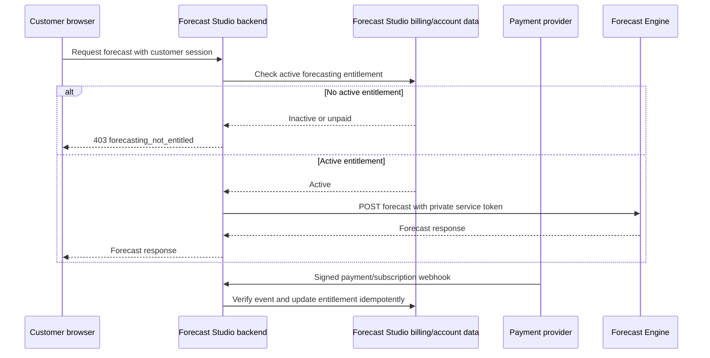

# Forecast Engine SaaS integration guide

Status: current public v1/v2 handoff for Forecasting Studio, 2026-08-17.

This is the handoff document for the agent implementing the Forecast Studio
webapp. It describes how the backend should call the protected forecasting
service. It does not contain a token or any other secret.

## Production endpoint

Base URL:

```text
https://engine.forecasting-studio.com
```

Use only these versioned public routes:

```text
POST /v1/saas/forecast
POST /v1/saas/forecast/csv
POST /v2/saas/forecast
```

Do not call the local routes (`/forecast`, `/forecast/csv`, `/health`,
`/models`, `/docs`, or `/v2/forecast`) from the SaaS. They are private
home-network routes and are not published through the public hostname.

## Security boundary

This must be a server-to-server integration. The bearer token must be stored in
the webapp backend's secret manager/runtime environment and must never be sent
to a browser, included in a frontend bundle, placed in a URL, committed to Git,
or written to logs.

The engine expects this header on every public request:

```http
Authorization: Bearer <SAAS_API_TOKEN>
```

The engine-side environment variable is `SAAS_API_TOKEN`. The webapp may use a
different internal secret name, such as `FORECAST_ENGINE_API_TOKEN`, as long as
the value is the same. Obtain the value through the private deployment secret
handoff; it is intentionally not included in this document.

## Billing-gated customer access

The v1 integration uses one shared service credential between the Forecast
Studio backend and the Forecast Engine. It does **not** create or expose an
Engine API key for each customer.

The customer account is authorized by the Forecast Studio backend. The browser
must call a Forecast Studio backend route, using the customer's normal session;
it must never call the Engine directly. Before forwarding a forecast request,
the backend checks the account's current subscription or entitlement. An
account that has not completed payment, or whose access is no longer active,
must be rejected before the Engine request is made.



The payment webhook is the source of truth for activation and deactivation.
The backend must verify the provider signature, process each event
idempotently, and update the account before allowing new forecast requests.
Do not activate access solely because the browser returned from a checkout
page.

Recommended webapp behavior:

- unauthenticated customer: `401` from the Forecast Studio backend;
- authenticated but unpaid/inactive customer: `403` with a stable machine-readable
  code such as `forecasting_not_entitled`;
- active customer: call the Engine using the backend-only
  `FORECAST_ENGINE_API_TOKEN` secret;
- Engine or tunnel failure: return a sanitized `502`/`504` without exposing
  the service token or upstream credentials.

If Forecast Studio later needs customer-facing API keys for third-party
integrations, those keys should be generated, hashed, revoked, and validated
by Forecast Studio. The request should still pass through the Forecast Studio
backend and use the same private Engine service token upstream. Do not add a
customer-key provisioning endpoint to the Forecast Engine for this v1 flow.

## JSON endpoint

Request:

```http
POST https://engine.forecasting-studio.com/v1/saas/forecast
Authorization: Bearer <SAAS_API_TOKEN>
Content-Type: application/json
User-Agent: ForecastStudio-SaaS/1.0
```

Example payload:

```json
{
  "data": [
    {"date": "2025-01-01T00:00:00Z", "target": 84.2},
    {"date": "2025-01-01T01:00:00Z", "target": 86.1},
    {"date": "2025-01-01T02:00:00Z", "target": 85.7}
  ],
  "forecast_horizon": 3,
  "datetime_col": "date",
  "target_col": "target",
  "frequency": "h",
  "engine": "chronos2"
}
```

The response is:

```json
{
  "predictions": [
    {
      "date": "2025-01-01T03:00:00.000",
      "target_predicted": 86.4,
      "lower_bound": 82.1,
      "upper_bound": 90.8
    }
  ]
}
```

### JSON fields

| Field | Type | Required | Notes |
| --- | --- | --- | --- |
| `data` | array of objects | yes | Must contain at least one record. |
| `forecast_horizon` | positive integer | yes | Number of future steps. |
| `datetime_col` | string | no | Defaults to `date`. |
| `target_col` | string | no | Defaults to `target`. |
| `item_id_col` | string or null | no | Set for panel/multiple-series data. |
| `frequency` | string | no | Defaults to `h`; for example `D` for daily data. |
| `random_state` | integer or null | no | Retained for backward compatibility; currently ignored by the forecasting implementation. |
| `engine` | `chronos` or `chronos2` | no | Defaults to `chronos2`. |
| `past_covariates` | array of objects or null | no | Supported with `chronos2`. |
| `future_covariates` | array of objects or null | no | Supported with `chronos2`. |

The request model rejects unknown top-level fields. Every `data` record must
contain the configured timestamp and target columns; panel data must also
contain `item_id_col`. Covariate records must contain the timestamp and, for
panel data, the item ID. Additional covariate columns are passed to the
forecasting package.

## Generic v2 JSON endpoint

Use this endpoint for Forecasting Studio features that need one or more related
targets, panel items, covariates, or native Chronos 2 multivariate inference:

```http
POST https://engine.forecasting-studio.com/v2/saas/forecast
Authorization: Bearer <SAAS_API_TOKEN>
Content-Type: application/json
```

The request and response are exactly the private `/v2/forecast` contract. For
example, a Draw-style movement request is generic rather than product-specific:

```json
{
  "data": [
    {"date": "2026-01-01T00:00:00Z", "dx": 1.2, "dy": 0.4},
    {"date": "2026-01-01T00:00:01Z", "dx": 1.3, "dy": 0.5},
    {"date": "2026-01-01T00:00:02Z", "dx": 1.4, "dy": 0.6}
  ],
  "target_cols": ["dx", "dy"],
  "forecast_horizon": 1,
  "frequency": "s",
  "model": "chronos2"
}
```

The stable response contains `timestamp`, `item_id`, `target_name`,
`prediction`, and `quantiles` for each target and future step. Keep
`target_cols` generic: one target, two targets, and larger target lists all use
the same endpoint and core path. The engine sends related targets jointly to
Chronos 2; the SaaS backend does not need a Draw-specific route.

V2 response timestamps are explicit UTC ISO 8601 values with a `Z` suffix, for
example `2026-01-01T00:00:03Z`. Reuse the returned `timestamp` directly as the
next request's input timestamp when appending predictions to the context; do
not append `Z` manually or convert the timezone in the client. This is the
expected round-trip behavior for sequential consumers such as Forecasting
Studio Draw.

## CSV endpoint

Use multipart form data:

```http
POST https://engine.forecasting-studio.com/v1/saas/forecast/csv
Authorization: Bearer <SAAS_API_TOKEN>
Content-Type: multipart/form-data
User-Agent: ForecastStudio-SaaS/1.0
```

Required file part:

```text
file
```

Optional file parts:

```text
past_covariates_file
future_covariates_file
```

Form fields and defaults:

| Field | Type | Default |
| --- | --- | --- |
| `datetime_col` | string | `date` |
| `target_col` | string | `target` |
| `item_id_col` | string | empty (single series) |
| `forecast_horizon` | positive integer | `24` |
| `frequency` | string | `h` |
| `engine` | `chronos` or `chronos2` | `chronos2` |
| `random_state` | integer | `42` |

The legacy `random_state` field is retained for backward compatibility and is
currently ignored by the forecasting implementation. It does not guarantee
reproducibility.

Example:

```bash
curl --fail-with-body \
  -X POST 'https://engine.forecasting-studio.com/v1/saas/forecast/csv' \
  -H 'Authorization: Bearer <SAAS_API_TOKEN>' \
  -H 'User-Agent: ForecastStudio-SaaS/1.0' \
  -F 'file=@history.csv;type=text/csv' \
  -F 'forecast_horizon=24' \
  -F 'frequency=h' \
  -F 'engine=chronos2'
```

Do not set `Content-Type: multipart/form-data` manually when using a webapp
HTTP client that generates the multipart boundary; let `FormData` set it.

## Backend TypeScript example

The call belongs in a backend service/action/route, not in browser code:

```ts
const baseUrl = "https://engine.forecasting-studio.com";
const token = process.env.FORECAST_ENGINE_API_TOKEN;

if (!token) {
  throw new Error("FORECAST_ENGINE_API_TOKEN is not configured");
}

const response = await fetch(`${baseUrl}/v1/saas/forecast`, {
  method: "POST",
  headers: {
    Authorization: `Bearer ${token}`,
    "Content-Type": "application/json",
    "User-Agent": "ForecastStudio-SaaS/1.0",
  },
  body: JSON.stringify({
    data: [
      { date: "2025-01-01T00:00:00Z", target: 84.2 },
      { date: "2025-01-01T01:00:00Z", target: 86.1 },
      { date: "2025-01-01T02:00:00Z", target: 85.7 },
    ],
    forecast_horizon: 3,
    frequency: "h",
    engine: "chronos2",
  }),
  // Forecasts are synchronous and queued; choose a timeout appropriate for
  // model loading plus earlier requests. There is no v1 latency SLA.
  signal: AbortSignal.timeout(10 * 60 * 1000),
});

if (!response.ok) {
  const detail = await response.text();
  throw new Error(`Forecast Engine ${response.status}: ${detail}`);
}

const result: { predictions: Array<Record<string, unknown>> } =
  await response.json();
```

The ten-minute timeout is a client-side starting recommendation, not an API
guarantee. Keep the timeout configurable and tune it after observing real
queue/model-loading times.

The explicit `User-Agent` identifies the backend client to Cloudflare's edge
security. Keep it on both JSON and CSV requests; do not use the default
`Python-urllib` user agent.

## Processing and retry behavior

- Requests are synchronous.
- Forecasts run one at a time in an in-memory queue.
- A request waits for earlier forecasts; there is intentionally no Redis,
  Celery, or external broker in v1.
- A server restart drops requests that were waiting in memory.
- There is no v1 latency SLA and no idempotency-key contract.
- A network timeout has unknown completion state: the engine may have finished
  the forecast even if the response was lost. Do not blindly retry a timed-out
  `POST`; make retries an explicit product decision because a retry can run the
  same forecast twice.
- The legacy `random_state` field is currently ignored; do not use it as a
  reproducibility or idempotency mechanism.

## HTTP status handling

| Status | Meaning | Client action |
| --- | --- | --- |
| `200` | Forecast completed. | Parse `predictions`. |
| `401` | Missing or invalid bearer token. | Check backend secret/configuration; do not retry unchanged. |
| `422` | Invalid request, CSV, timestamps, columns, or forecast configuration. | Return a user-facing validation error after sanitizing details. |
| `503` | Engine token is not configured. | Treat as deployment/configuration incident. |
| `500` | Unexpected engine/runtime failure. | Log a correlation-safe error and surface a generic failure. |
| `502`, `504` | Proxy/tunnel/upstream failure or timeout. | Follow the explicit timeout/retry policy; completion may be unknown. |

Do not expose the bearer token or raw upstream headers in application logs or
client-visible error messages.

## Integration acceptance checklist

Before enabling the feature in production, the webapp agent should verify:

- [ ] The token exists only in the backend secret manager/runtime environment.
- [ ] No frontend/browser request contains the token.
- [ ] The backend calls `https://engine.forecasting-studio.com`.
- [ ] JSON uses `/v1/saas/forecast` and the documented fields.
- [ ] CSV uses `/v1/saas/forecast/csv` and multipart file parts.
- [ ] Generic multivariate JSON uses `/v2/saas/forecast` with `target_cols`.
- [ ] The client timeout is configurable and long enough for queue/model load.
- [ ] `401`, `422`, `503`, `500`, and timeout behavior are handled.
- [ ] Tokens, payloads containing sensitive business data, and raw credentials
      are not logged.
- [ ] A successful staging smoke test receives a `predictions` array.

## Canonical references

- [Full API contract](saas-api.md)
- [Deployment and public/private topology](saas-deployment.md)
- [Mac Mini bootstrap and secret handoff](mac-mini-bootstrap.md)
